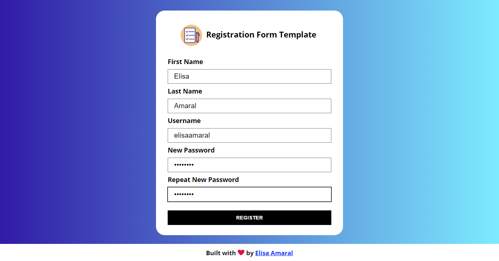

# Registration Form Template with JavaScript Validation

This project is a registration form template with field validation. When there's an error, such as an empty field or a password with less than 6 characters, error messages are displayed under the fields. 

The user must then try again with the correct input, reloading the page is not necessary. When all inputs are correct, an alert indicates that the form should then be sent to the backend for data treatment. 

## Project Link

**https://registration-form-with-js-validation.netlify.app/**

## Screenshot

## Technology Stack

+ JavaScript (Object-Oriented Programming)
+ HTML
+ CSS
